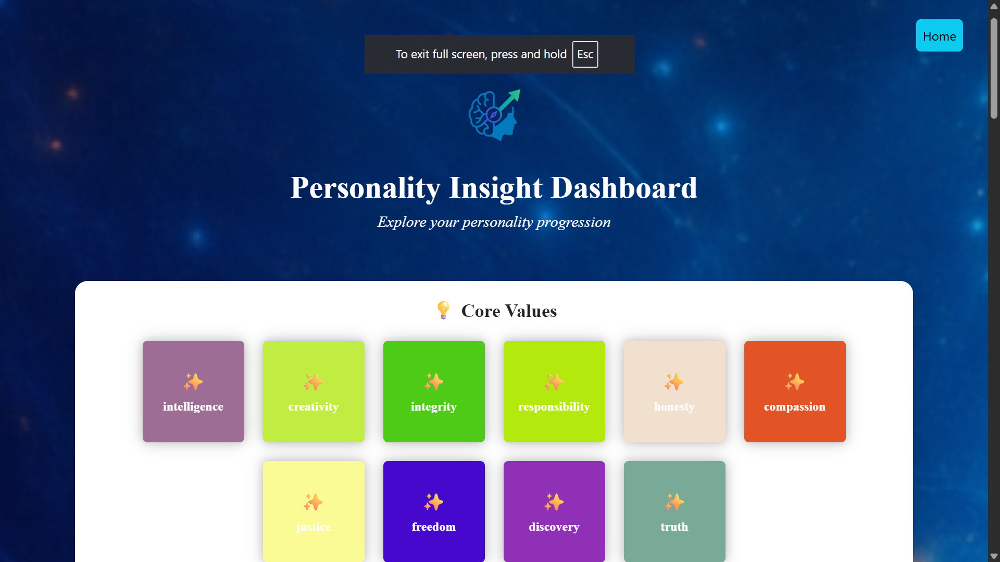

# 📸 InstaCareer

InstaCareer is a platform that lists curated career paths for students and professionals by analyzing their social media data, such as YouTube, using an LLM model. Based on their interests rather than relying on traditional approaches, it suggests the career paths that may be most suitable for them.


# Get Personlized Dashboard



# How to get started?

## This project uses docker to make the getting start easy, please make sure you have docker
Note. docker is not madatory it just keeps the things simple

### Clone the Repo

```bash
git clone https://github.com/rookie-engg/InstaCareer.git

```bash
cd InstaCareer

```bash
docker compose up --build -d
